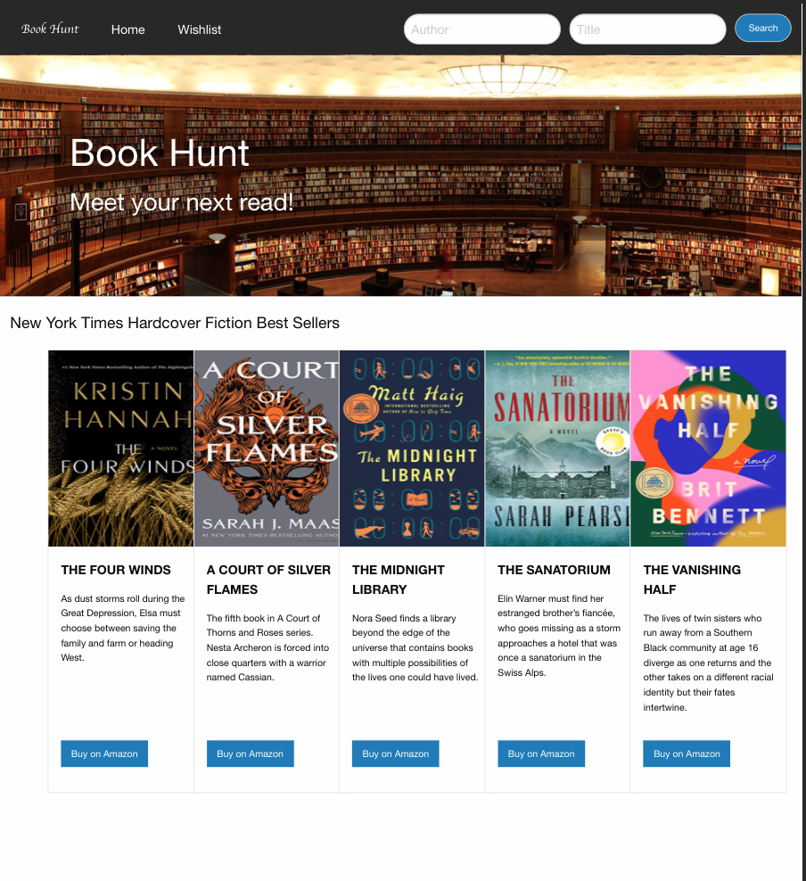

# Book Hunt

## Discription
Book Hunt is an application designed with avid readers in mind, it provides the user/reader with a number of choices to find the prefect book from the comfort of their own homes.

## Features
1. The user will automatically see five current Best Sellers from the New York Times Best  Sellers list.
2. The user is able to search for a desired book by title or by author. 
3. The user can perform this search by clicking the Enter key or clicking the Search button.
4. When the user makes a choice based on their search, the user is provided information   about the book (Book Name, Author Name, Book Synopsis, Rating and redirects user to Amazon for buying options).
5. The user can then save desired book/books to their own wishlist for later access.

#### Future tasks for this application includes:
* After adding a book to the wish list, you will be able to removing it.
* Dropdown list for all categories of NYT best sellers.
* Drop down menu for “more info” to have more resources to buy the book.
* The search bar will clear once you have submitted the search.

## Contributors
[NohaAshraf85](https://www.github.com/NohaAshraf85)
[srad25](https://www.github.com/srad25)
[Neel109](https://www.github.com/Neel109)
[aseppala98](https://www.github.com/aseppala98)

## Resources
Google Books API and New York Times API for information on books.
Foundation 6 CSS was used in the development of this application

https://github.com/srad25/Group-Project
https://srad25.github.io/Group-Project