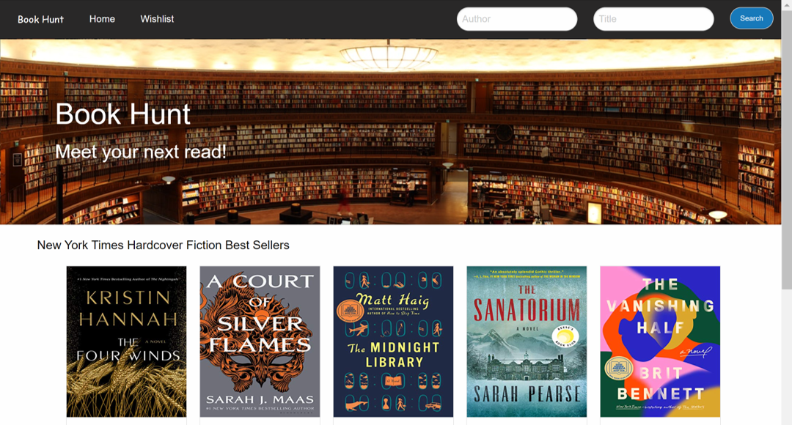
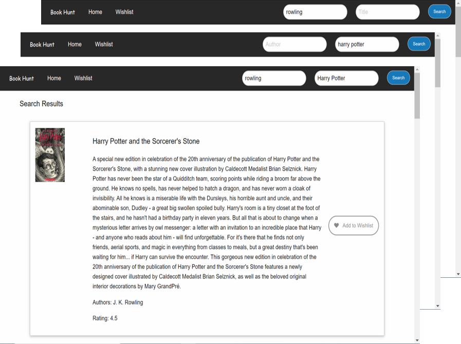
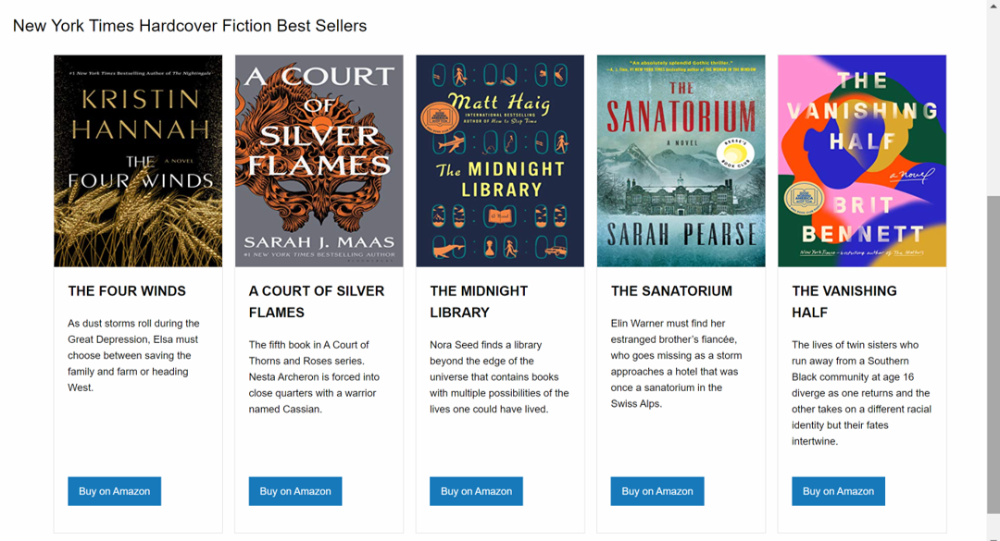
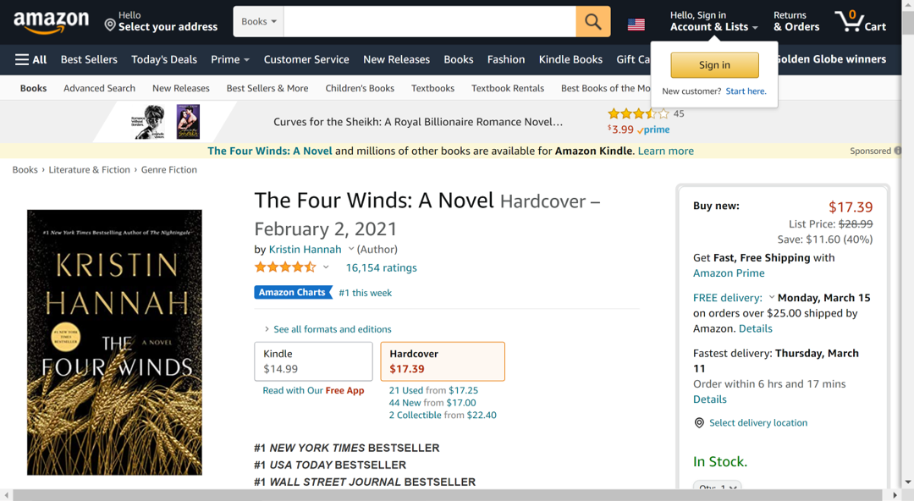
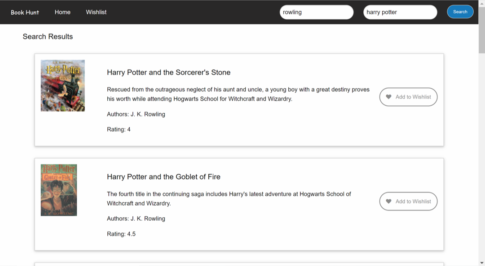
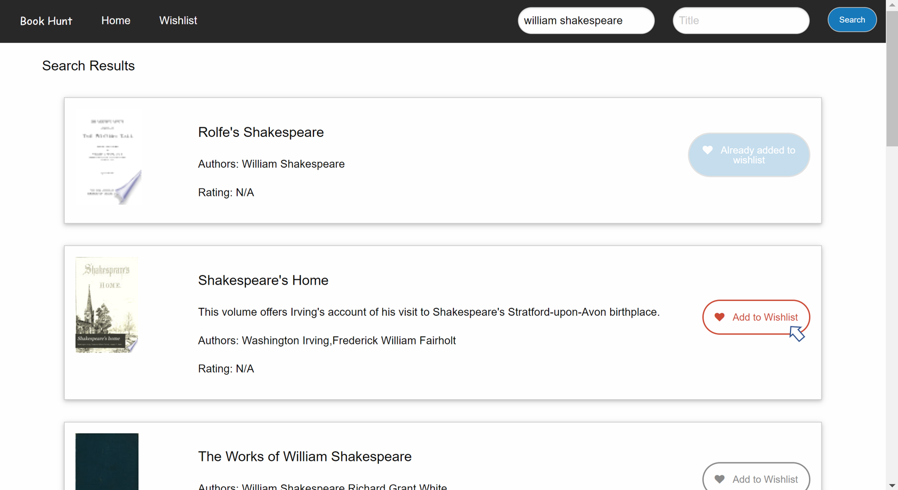
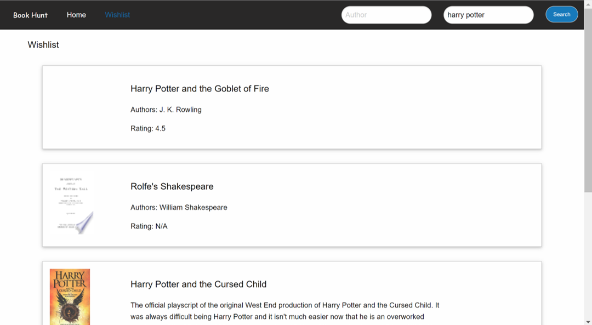

# Book Hunt
## Project Overview:
Book Hunt is an application designed with avid readers in mind, having a one stop shop application where it provides the user/reader with a number of choices to find the prefect book from the comfort of their own homes. 

## Technologies Used:
1. HTML
2. CSS
3. Foundation 6 front-end framework
4. Javascript
5. jQuery
6. New York Times Best Sellers API
7. Google Books API

## How Book Hunt Works:
The homepage of Book Hunt is a clean easy to navigate page where the user is presented with the main functionality of the applicaiton.

## Features:
### Homepage Component:
1. Navigation Bar
    * Two Search Boxes
        * Search by Author
        * Search by Title
    * Search button
2. Hero image
3. Main section that displays the current five New York Times Hardcover Fiction Best Sellers
    * Buy on Amazon button, redirects the user to Amazon to purchase the book

### Navigation Bar:
The navigation bar in Book Hunt provides the user with an easy navigation and search experience. The user can easily navigate through the website current pages (Home, Wishlist) easily to move around the website easily. The user can also search for a book by its author, book title or both, this search is performed through integrating with Google Books API's [Google Books API](https://developers.google.com/books/docs/overview)

### New York Times Best Sellers Cards - Hardcover-Fiction
The main body of the page displayes 5 cards that are populated through integration with the New York Times Best Sellers API's [New York Times Best Sellers API](https://developer.nytimes.com/docs/books-product/1/overview)

The current scope of the project provides only one genre (hardcover-fiction), with a future vision to provide more, please refer to the future phases section.

Every card includes a Buy on Amazon button, this button redirects the user the relevant Amazon page to purchase the book.

#### Search Results Page:
The user is redirected to the Search Results page upon performing a search.

The following example depicts the search results page for a search that was performed using both (author and title) 

The current stage of Book Hunt provides only nine (9) search results, with a future vision to provide more, please refer to the future phases section.

The Search Results page provides the user with the capability of adding a book to the Wishlist page through the Add to Wishlist button.

The add to Wishlisy button has 3 displays:
* The default display of the button is light grey color and the button name default is Add to Wishlist
* If the user hovers over the button it will change color and turn into red showing that it can be added to the wishlist
* If the book has already been added to the wishlist the button shall be displayed with a dimmed blue color and the button name changes into Already Added to Wishlist, and at this stage the button is inactive and cannot be pressed again. with a future vision to provide more, please refer to the future phases section.

#### Wishlist Page:
The wishlist page displays the books that the user added to it through the Search Results page only at this stage, with a future vision to provide the same through the best sellers directly, please refer to the future phases section.

At this stage the wishlist page does not provide the user with the option to remove an item from the wishlist, this shall be provided in future phases.

## Responsive Design:
Book Hunt is designed using Foundation 6 which is one of the most advanced responsive fron-end frameworks, Book Hunt gives the user a very easy user experience on different devices with a clean and polished UI.

## Future Development:
Best Sellers
1. Displaying all book genres from the NYT Best Sellers
2. Several buying options other than Amazon
3. Ability to browse more than the 5 best sellers displayed by default
4. Directly add a NYT best seller to the wishlist

Google Books
1. Ability to buy
2. The search results to display more than 9 options

Wishlist
1. Remove a book from the wishlist
2. Buy a book directly from the wishlist page

Search
1. Search to clear automatically after the search result is rendered

## Contributers
* [NohaAshraf85](https://www.github.com/NohaAshraf85)
* [srad25](https://www.github.com/srad25)
* [Neel109](https://www.github.com/Neel109)
* [aseppala98](https://www.github.com/aseppala98)

## View deployed application
* https://srad25.github.io/Book-Hunt
* https://github.com/srad25/Book-Hunt

